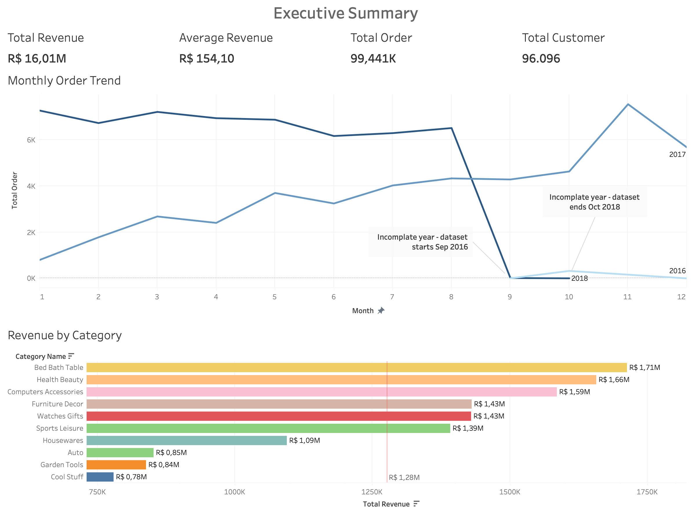
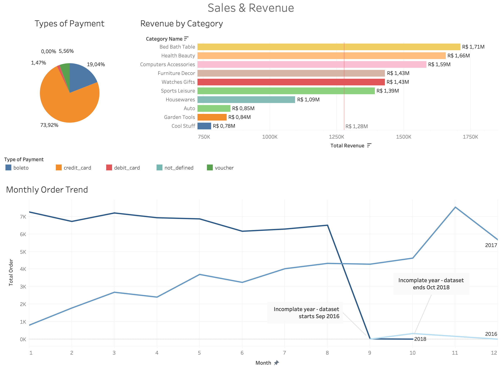
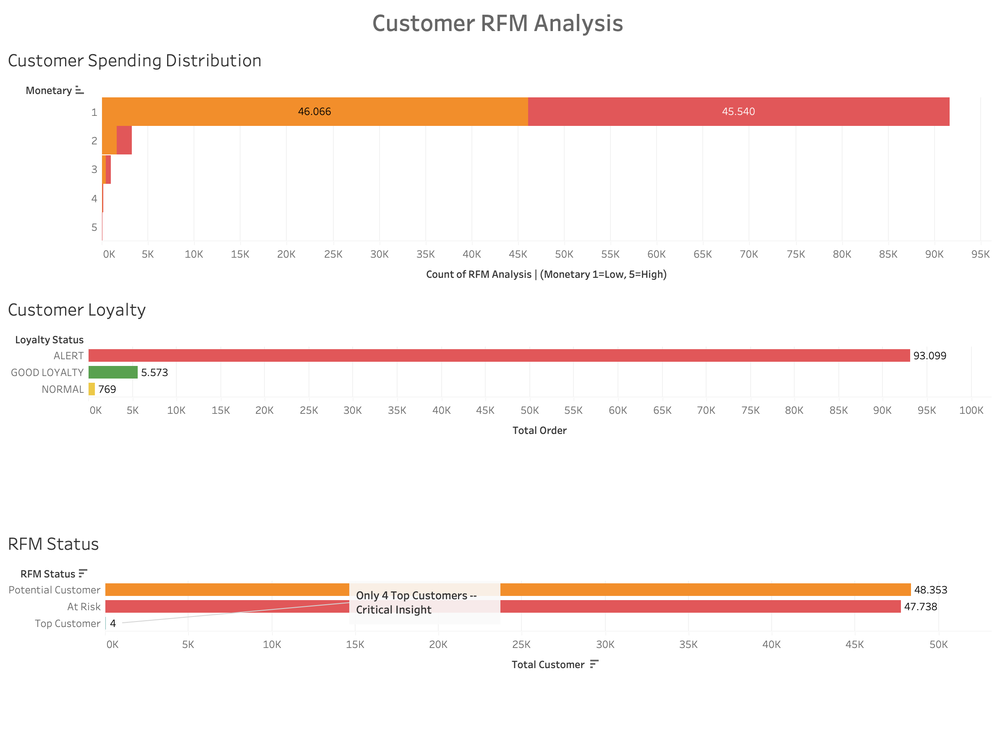
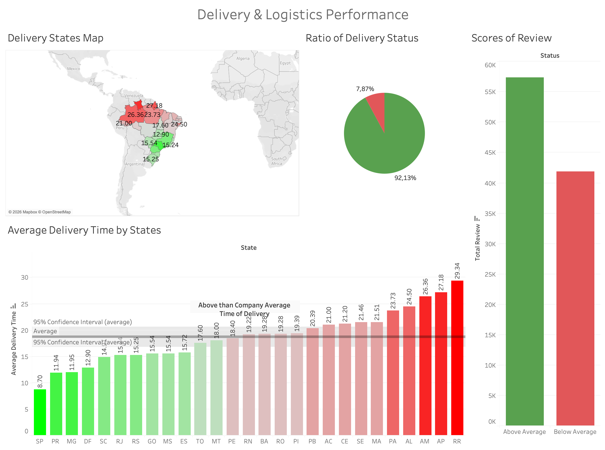
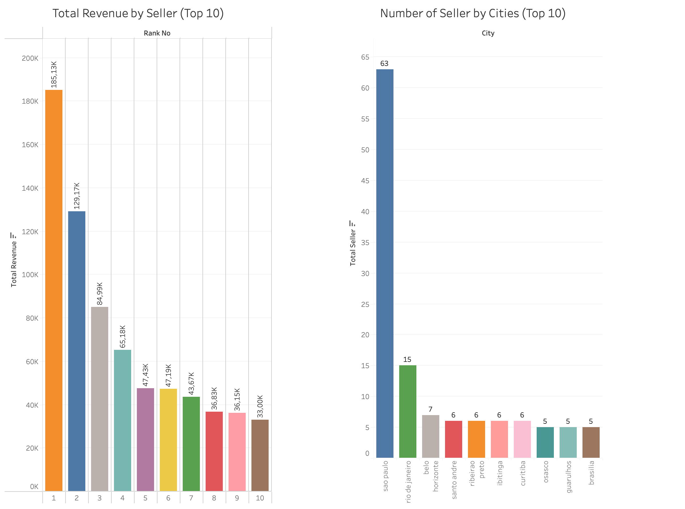

# data-driven-ecommerce-insights
End-to-end business intelligence project on Brazilian e-commerce data using MySQL and Tableau. Covers customer behavior, sales trends, delivery performance, seller analysis, and RFM segmentation.
# 🛒 Olist E-Commerce — End-to-End Business Intelligence Project


## 📌 Project Overview

This is a full end-to-end business intelligence project built on **Olist**, a real Brazilian e-commerce marketplace. Using a publicly available dataset from Kaggle, I designed and executed a complete analysis pipeline — from raw data exploration in MySQL to interactive dashboards in Tableau.

The project was built to answer the questions a CEO or data team would actually ask, and to demonstrate the ability to turn messy, real-world data into clear business insights.

---

## 🎯 Business Questions Answered

- Where do our customers come from — and are they coming back?
- Which product categories generate the most revenue?
- How fast do we deliver, and does speed affect review scores?
- Which sellers drive the most revenue, and where are they located?
- Who are our most valuable customers? *(RFM Segmentation)*

---

## 📊 Tableau Dashboards

### Executive Summary


### Sales & Revenue


### Customer & RFM Analysis


### Delivery & Logistics Performance


### Seller Performance


---

## 🗂️ Dataset

**Source:** [Kaggle — Brazilian E-Commerce Public Dataset by Olist](https://www.kaggle.com/datasets/olistbr/brazilian-ecommerce)

| Table | Rows | Description |
|---|---|---|
| customers | 98,833 | Customer info and location |
| orders | 98,150 | Order status and timestamps |
| order_items | 111,230 | Products per order |
| order_payments | 103,515 | Payment method and value |
| order_reviews | 97,677 | Customer review scores |
| products | 32,334 | Product details and category |
| sellers | 289 | Seller location info |
| geolocation | 1,010,247 | Brazilian zip code coordinates |
| product_category_translation | 71 | Portuguese → English category names |

---

## ⚠️ Data Quality & Limitations

This dataset contains real-world data quality issues. Rather than ignoring them, I identified, handled, and documented each one transparently.

**1. Incomplete Date Range**

The dataset starts in September 2016 (first 8 months missing) and ends in October 2018 (last 2 months missing). Only 2017 contains a complete 12-month period.

When sharp drops appeared in trend charts — for example the sudden collapse at month 9 in 2018 — I did not treat these as business anomalies. Instead, I added annotation labels directly in Tableau at each breakpoint:

> *"Incomplete year — dataset starts Sep 2016"*
> *"Incomplete year — dataset ends Oct 2018"*

This prevents misleading stakeholders who might otherwise interpret data cutoffs as real business decline.

**2. NULL and Empty String Delivery Dates**

Several rows contained delivery dates stored as empty strings `''` rather than true NULL values. A standard `IS NOT NULL` filter was not sufficient. I resolved this with a combined condition:

```sql
WHERE order_delivered_customer_date IS NOT NULL
  AND order_delivered_customer_date != ''
  AND order_purchase_timestamp IS NOT NULL
  AND order_purchase_timestamp != ''
```

---

## 🧱 Project Structure

```
olist-ecommerce-analysis/
├── README.md
├── sql/
│   ├── module_1_customer_analysis.sql
│   ├── module_2_order_analysis.sql
│   ├── module_3_product_analysis.sql
│   ├── module_4_revenue_analysis.sql
│   ├── module_5_seller_analysis.sql
│   ├── module_6_review_analysis.sql
│   └── module_7_customer_segmentation.sql
├── data/
│   ├── Customer Analysis/
│   ├── Order Analysis/
│   ├── Product Analysis/
│   ├── Revenue Analysis/
│   ├── Review Analysis/
│   ├── Seller Analysis/
│   └── Customer Segmentation/
└── tableau/
    ├── Executive_Summary.png
    ├── Sales_Revenue.png
    ├── Customer_RFM_Analysis.png
    ├── Delivery___Logistics_Performance.png
    └── Seller_Performance.png
```

---

## 🔍 SQL Modules

### Module 1 — Customer Analysis
- Customer distribution by state
- Returning customers (`HAVING` clause)
- Customer loyalty segmentation (`CASE WHEN`)
- Loyalty group summary (subquery)

### Module 2 — Order Analysis
- Order status distribution
- Monthly order trend (`YEAR` + `MONTH` functions)
- Average delivery time (`DATEDIFF` + NULL/empty string handling)
- Average delivery time by state (JOIN + aggregation)
- Delivery status by city (`ROW_NUMBER()` window function)
- Delivery status summary — EARLY / LATE / AT TIME (subquery)

### Module 3 — Product Analysis
- Order distribution by category (4-table JOIN)
- Revenue distribution by category (4-table JOIN)

### Module 4 — Revenue Analysis
- Total revenue and average order value
- Payment type distribution
- Average order value by payment method

### Module 5 — Seller Analysis
- Seller performance: revenue + review score (4-table JOIN)
- Total orders per seller
- Seller distribution by city
- Seller revenue ranking (`RANK()` window function + CTE)

### Module 6 — Review Analysis
- Review score distribution (`CASE WHEN` + correlated subquery)
- Delivery time vs review score (CTE)

### Module 7 — Customer Segmentation
- RFM scoring: Recency, Frequency, Monetary (multi-CTE)
- Customer segment summary

---

## 🛠️ SQL Techniques Demonstrated

| Technique | Where Used |
|---|---|
| Multi-table `JOIN` (up to 4 tables) | Modules 1, 3, 4, 5, 6, 7 |
| `CASE WHEN` | Modules 1, 2, 6 |
| Subqueries | Modules 1, 6 |
| `CTE` (WITH ... AS) | Modules 5, 6, 7 |
| `ROW_NUMBER()` | Module 2 |
| `RANK()` | Module 5 |
| `DATEDIFF` | Modules 2, 6 |
| `HAVING` | Module 1 |
| `INFORMATION_SCHEMA` | Database exploration |
| NULL + empty string handling | Module 2 |
| RFM scoring logic | Module 7 |

---

## 💡 Key Business Insights

| Insight | Finding |
|---|---|
| 🏙️ Geographic concentration | São Paulo accounts for 42% of all customers and 63 of 289 sellers |
| 🔁 Customer retention crisis | 97% of customers (93,099) placed only one order — serious loyalty problem |
| ⭐ Delivery drives reviews | 1-star customers waited avg. 21 days vs 10.6 days for 5-star — 2× difference |
| 💳 Credit card dominates | 74% of payments by credit card, with highest avg. order value (R$ 163) |
| 🚚 North Brazil waits longest | RR: 29 days, AP: 27 days, AM: 26 days — vs SP: 8.7 days |
| 🏆 Only 4 Top Customers | RFM analysis found only 4 customers at the highest loyalty tier |
| ✅ 92% early delivery rate | Despite long absolute times, 92% of orders arrived before estimated date |
| 🛏️ Top category | Bed & Bath Table leads both in order volume and revenue (R$ 1.71M) |

---

## 🚀 Tools & Technologies

- **MySQL** — Data querying and analysis
- **MySQL Workbench** — Query execution and result export
- **Tableau Public** — Dashboard design and visualization
- **VSCode** — SQL file organization and version control
- **Git / GitHub** — Portfolio hosting

---

## 👤 About

Built as a portfolio project to demonstrate SQL and data visualization skills for data analyst roles.

📎 [LinkedIn](https://www.linkedin.com/in/candankubi/) | 📊 [Tableau Public](https://public.tableau.com/app/profile/k.c1940/viz/Data-DrivenE-CommerceInsightsSalesLogisticsCustomerRFMAnalysis/ExecutiveSummary?publish=yes)
